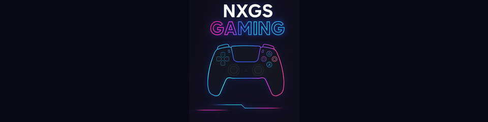

# [NXGS Gaming](https://github.com/sowankispassah/nxgs_play)

NXGS Gaming is an open source remote play client fork maintained by NXGS Studio. It is based on chiaki-ng, which is based on the original Chiaki project. Source code and project documentation are currently available at <https://github.com/sowankispassah/nxgs_play>.

## Fork Attribution

NXGS Gaming is a fork of chiaki-ng, which is based on Chiaki. This fork is distributed under the GNU Affero General Public License v3.0.

The original chiaki-ng and Chiaki credits, contributor attributions, copyright notices, and license files are retained in this repository.

## Source Code Availability

The complete corresponding source code for NXGS Gaming is available at: https://github.com/sowankispassah/nxgs_play

## Branding Assets

NXGS Gaming placeholder branding assets are tracked in this fork. See [BRANDING_ASSETS.md](BRANDING_ASSETS.md) for files that must be replaced before publishing final app builds.

## Windows Portable Release

The Windows portable release is a folder named `NXGS-Gaming-Win`. Open `NXGS Gaming.exe` inside that folder to run the app. The folder also contains the required Qt/runtime DLLs, license files, upstream attribution, and `SOURCE_CODE.txt`.

To create this folder from a configured Windows build environment:

```powershell
.\scripts\package-windows-portable.ps1 -Zip
```

The GitHub Actions Windows workflows also package the app this way.

## Disclaimer

NXGS Gaming is not affiliated with, endorsed by, sponsored by, or certified by Sony Interactive Entertainment LLC, PlayStation, chiaki-ng, Chiaki, or the original maintainers.

Chiaki is a Free and Open Source Software Client for PlayStation 4 and PlayStation 5 Remote Play
for Linux, FreeBSD, OpenBSD, Android, macOS, Windows, Nintendo Switch and potentially even more platforms.
